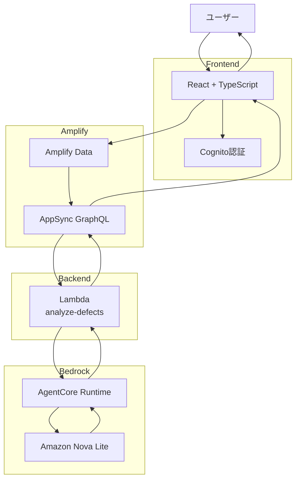

# AWS構成図

```mermaid
flowchart TD

    U[ユーザー]

    subgraph Frontend
        R[React + TypeScript]
        C[Cognito認証]
    end

    subgraph Amplify
        D[Amplify Data]
        A[AppSync GraphQL]
    end

    subgraph Backend
        L[Lambda<br/>analyze-defects]
    end

    subgraph Bedrock
        AG[AgentCore Runtime]
        N[Amazon Nova Lite]
    end

    U --> R

    R --> C

    R --> D

    D --> A

    A --> L

    L --> AG

    AG --> N

    N --> AG

    AG --> L

    L --> A

    A --> R

    R --> U
```