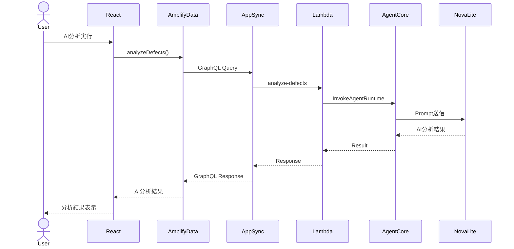

# AI分析シーケンス図

```mermaid
sequenceDiagram

    actor User

    participant React
    participant AmplifyData
    participant AppSync
    participant Lambda
    participant AgentCore
    participant NovaLite

    User->>React: AI分析実行

    React->>AmplifyData: analyzeDefects()

    AmplifyData->>AppSync: GraphQL Query

    AppSync->>Lambda: analyze-defects

    Lambda->>AgentCore: InvokeAgentRuntime

    AgentCore->>NovaLite: Prompt送信

    NovaLite-->>AgentCore: AI分析結果

    AgentCore-->>Lambda: Result

    Lambda-->>AppSync: Response

    AppSync-->>AmplifyData: GraphQL Response

    AmplifyData-->>React: AI分析結果

    React-->>User: 分析結果表示
```