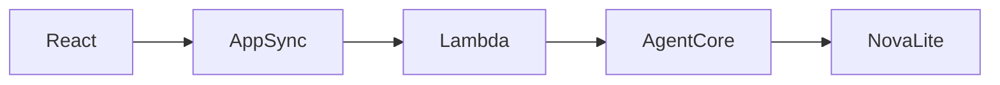
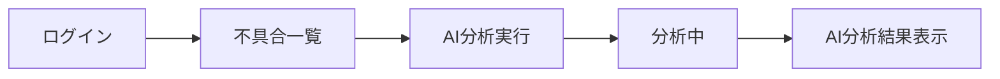

# AI不具合分析機能 実装報告書

## 1. 背景

Excelで管理する不具合管理システムでは、登録された不具合情報を個別に確認・分析しており、分析に時間がかかることや、分析内容にばらつきが生じる課題があった。

また、行動目標の不具合管理・分析による品質改善とフロントエンドやモダン技術の学習を並行して行っているため、学習の成果物として不具合管理を行うアプリケーションを作成したいと考えた。

そこで、生成AIを活用し、不具合情報から傾向分析や改善案を自動生成する機能を追加することで、分析作業の効率化と品質向上を目的として、本機能の実装を行った。

---

# 2. 目的

AWSの生成AIサービス（Amazon Bedrock AgentCore Runtime、Amazon Nova Lite）を利用し、不具合一覧をAIが分析できるWebアプリケーションを構築する。

また、ReactとAWS Amplify Gen2を組み合わせたフルスタックアプリケーション開発を通して、フロントエンド開発技術及びAWSを利用したAIアプリケーション開発技術を習得することを目的とした。

---

# 3. システム構成



---

# 3.1 AI分析画面

# AI分析画面



## 画面イメージ


図3-1 AI分析画面


# 3.2 AWS構成図

本システムではAWS Amplify Gen2を中心とし、認証・API・Lambda・生成AIを連携してAI分析機能を実現している。

```text
                ┌──────────────────────┐
                │      React           │
                │  (TypeScript/Vite)   │
                └──────────┬───────────┘
                           │
                           │ Cognito認証
                           ▼
                ┌──────────────────────┐
                │ Amazon Cognito       │
                └──────────┬───────────┘
                           │
                           ▼
                ┌──────────────────────┐
                │ Amplify Data         │
                │ (GraphQL Client)     │
                └──────────┬───────────┘
                           │
                           ▼
                ┌──────────────────────┐
                │ AppSync(GraphQL API) │
                └──────────┬───────────┘
                           │
                           ▼
                ┌──────────────────────┐
                │ Lambda               │
                │ analyze-defects      │
                └──────────┬───────────┘
                           │
                           ▼
        ┌──────────────────────────────────┐
        │ Amazon Bedrock AgentCore Runtime │
        └──────────┬───────────────────────┘
                   │
                   ▼
        ┌──────────────────────────────────┐
        │ Amazon Nova Lite                 │
        └──────────┬───────────────────────┘
                   │
                   ▼
              AI分析結果
```

図3-2 AWSシステム構成


# 3.3 AI分析シーケンス

AI分析実行時の処理の流れを以下に示す。

```text
ユーザー
   │
   │ AI分析実行
   ▼
React (AnalysisPage)
   │
   │ GraphQL Query
   ▼
Amplify Data
   │
   ▼
AppSync
   │
   ▼
Lambda(analyze-defects)
   │
   │ InvokeAgentRuntime
   ▼
AgentCore Runtime
   │
   │ Prompt送信
   ▼
Amazon Nova Lite
   │
   │ AI分析結果
   ▼
AgentCore Runtime
   │
   ▼
Lambda
   │
   ▼
AppSync
   │
   ▼
React
   │
   ▼
AI分析結果表示
```

図3-3 AI分析シーケンス図


# 4. 実施内容

## 4.1 フロントエンド

AI分析機能を利用できる画面を作成した。

### 実装内容

- AI分析実行ボタン追加
- AI分析結果表示エリア追加
- AI分析中のローディング表示
- React Hook（useAIAnalysis）作成
- AI呼び出しサービス（aiAnalysis.ts）作成

---

## 4.2 バックエンド

AWS Amplify Gen2を利用してAI分析APIを構築した。

### 実装内容

- Lambda Function作成
- AppSync Custom Query作成
- LambdaからAgentCore Runtime呼び出し
- Nova Liteへのプロンプト送信
- AI分析結果返却

---

## 4.3 AWS

以下のサービスを利用した。

|サービス|用途|
|--------|----|
|Amazon Cognito|ログイン認証|
|Amplify Gen2|バックエンド構築|
|AppSync|GraphQL API|
|Lambda|AI呼び出し処理|
|AgentCore Runtime|AIエージェント実行|
|Amazon Nova Lite|生成AIモデル|

---

# 5. 工夫した点

## ① AI処理をサービス化

AI呼び出し処理を画面へ直接実装せず、

- Hook
- Service

へ分離した。

これにより、

- 保守性向上
- 再利用性向上
- UIとビジネスロジックの分離

を実現した。

---

## ② エラーハンドリング

AI分析失敗時には、

- GraphQLエラー
- AIからのエラー
- 入力チェック

を個別に判定し、利用者へ適切なエラーメッセージを表示するようにした。

---

## ③ IAM権限の設定

LambdaからAgentCore Runtimeを呼び出すため、

```
bedrock-agentcore:InvokeAgentRuntime
```

権限を追加した。

AWSのIAMポリシーについて理解を深めることができた。

---

## ④ 認証方式の統一

GraphQL呼び出しを

```
userPool
```

認証へ統一し、ログイン済みユーザーのみAI分析できる構成とした。

---

# 6. 発生した課題と対応

|課題|対応内容|
|----|--------|
|TypeScript型エラー|Reactコード修正|
|Material UI(Stack)エラー|sxプロパティへ変更|
|AuthProviderエラー|Provider構成を修正|
|json-server未起動|ローカルサーバー起動|
|Unauthorizedエラー|認証設定見直し|
|Lambda権限不足|IAMポリシー追加|
|AgentCore Runtime実行エラー|Invoke権限追加|

---

# 7. 動作確認

以下の一連の処理が正常に実行できることを確認した。

```
ログイン

↓

不具合一覧取得

↓

AI分析実行

↓

Lambda実行

↓

AgentCore Runtime

↓

Nova Lite

↓

AI分析結果表示
```

---

# 8. 得られた成果

## 技術面

以下のAWSサービスを組み合わせたAIアプリケーションを構築できた。

- React
- TypeScript
- AWS Amplify Gen2
- Amazon Cognito
- GraphQL(AppSync)
- Lambda
- AgentCore Runtime
- Amazon Nova Lite

---

## 学習面

今回の実装を通して、

- Amplify Gen2のバックエンド構築
- GraphQL API作成
- Cognito認証
- Lambda実装
- IAM権限設定
- AgentCore Runtime利用方法
- Amazon Nova Lite連携

について理解を深めることができた。

また、AWSサービス間の連携方法や、AIアプリケーションの構築手順を実践的に学ぶことができた。

---

# 9. 今後の改善

今後は以下の機能追加を予定している。

- AIプロンプト改善
- 分析条件指定（期間・担当者など）
- AI分析履歴保存
- Markdown表示
- PDF出力
- Excel出力
- グラフ表示
- AIによる優先度判定
- AIによる改善案生成

---

# 10. まとめ

AWS Amplify Gen2とAmazon Bedrock AgentCore Runtimeを利用したAI不具合分析機能を実装し、不具合一覧からAIによる分析結果を取得・表示する機能を構築した。

フロントエンドからバックエンド、生成AIまで一連の処理を実装することで、AWSを活用したAIアプリケーション開発の流れを理解するとともに、実務を意識した構成や認証・権限管理を含めた実装経験を得ることができた。